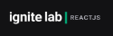

<div align="center">
    
    <p>Online class registration and viewing platform.</p>
</div>

# 💻 Overview

## 👀 About
Discover a seamless experience in online education with our platform. Register for classes effortlessly and enjoy convenient access to engaging content from anywhere.

<div align="center">
  
</div>

## 🚀 Technologies


And others:
-   **[GraphCMS](https://graphcms.com/)**
-   **[GraphQL Code Generator](https://www.graphql-code-generator.com/)**

## ✅ Features

- [ ] Authentication for subscriber users
- [ ] Responsiveness


# 💻 Getting started

## Requirements

Before you begin, you will need to have the following tools installed on your machine:
[Git](https://git-scm.com), [npm](https://www.npmjs.com/)
In addition, it is good to have an editor to work with the code like [VSCode](https://code.visualstudio.com/).

Besides that, clone the GraphCMS project [here](https://app.graphcms.com/clone/0b394a8ea4de4556b22aaff741187e9b?name=Ignite%20Lab%20-%20Kassia%20Fraga) and get the Content API URL and generarate a permanent auth token if it doesn't exist.

## 👉 Run project
```bash

# Clone this repository
$ git clone https://github.com/KassiaMabily/Event-Platform.git

# go to the project folder
$ cd Event-Platform

# install modules
$ npm install

# run
$ npm run dev

# generate schemas
$ npm run codegen

```

# 📝 License

This project is licensed under the MIT License - see the [LICENSE](LICENSE) file for details.

---
⌨️ com ❤️ por [Kassia Fraga](https://github.com/KassiaMabily) 😊
