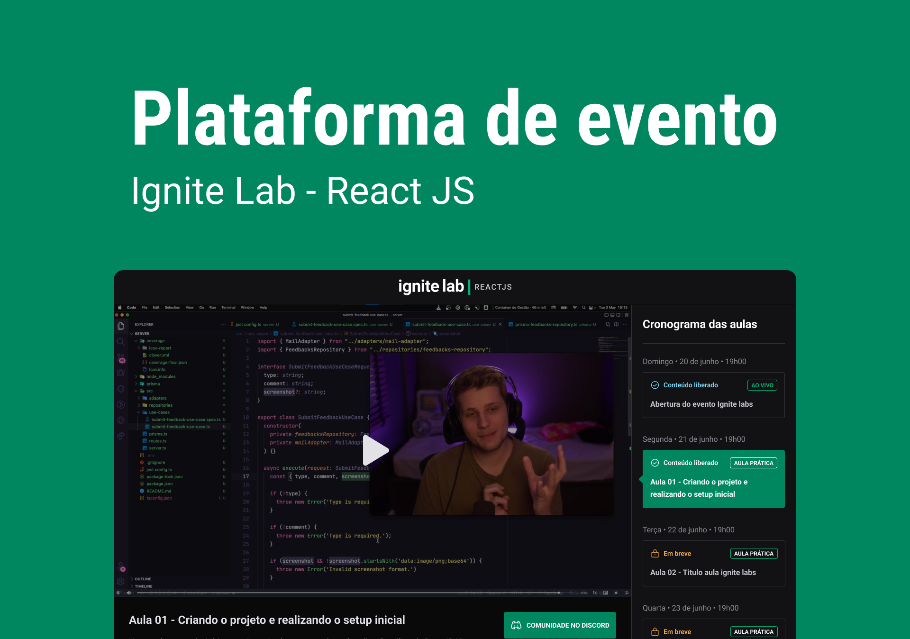

<p align="center">
    
</p>

<h3 align="center">
    Plataforma de inscrição e visualização de aulas online
</h3>

<p align="center">
    
    
    <a href="https://github.com/KassiaMabily/Event-Platform/commits/main">
        
    </a>
    
</p>

<h4 align="center">
	🚧 Development 🚧

    
</h4>

<p align="center">
    <a href="#about">About</a> •
    <a href="#features">Features</a> •
    <a href="#how-it-works">How it works</a> • 
    <a href="#tech-stack">Tech Stack</a> • 
    <a href="#author">Authors</a> • 
    <a href="#user-content-license">License</a>
</p>

## 💻 Overview

### [Demo](https://event-platform-fawn.vercel.app/)



---
## ✅ Features


- [ ] Authentication for subscriber users
- [ ] Responsiveness

---

## ⚙️ How it works

...

### 👉 Pre-requisites

Before you begin, you will need to have the following tools installed on your machine:
[Git](https://git-scm.com), [npm](https://www.npmjs.com/)
In addition, it is good to have an editor to work with the code like [VSCode](https://code.visualstudio.com/).

Besides that, clone the GraphCMS project [here](https://app.graphcms.com/clone/0b394a8ea4de4556b22aaff741187e9b?name=Ignite%20Lab%20-%20Kassia%20Fraga) and get the Content API URL and generarate a permanent auth token if it doesn't exist.

### 👉 Run project
```bash

# Clone this repository
$ git clone https://github.com/KassiaMabily/Event-Platform.git

# go to the project folder
$ cd Event-Platform

# install modules
$ npm install

# run
$ npm run dev

# generate schemas
$ npm run codegen

```

## 🚀 Tech Stack

The following tools were used in the construction of the project:

-   **[Vite](https://vitejs.dev/)**
-   **[ReactJS](https://pt-br.reactjs.org/)**
-   **[Apollo GraphQL](https://www.apollographql.com/)**
-   **[GraphCMS](https://graphcms.com/)**
-   **[GraphQL Code Generator](https://www.graphql-code-generator.com/)**
-   **[Typescript](https://www.typescriptlang.org/)**

---

## Authors
<table>
    <tr>
    <td align="center">
        <p>
            <a href="#">
                
                <br />
                <sub><b>Kassia Fraga</b></sub></a><a href="#" title="Kassia Fraga">
            </a>
            <br/>

[](https://www.linkedin.com/in/kassia-fraga/) 
[](https://www.instagram.com/dev.naotaosedentaria/)
[](mailto:kassiafraga7@gmail.com)
        </p>
    </td>
    </tr>
</table>

---

## 📝 Licença

Este projeto esta sobe a licença [MIT](./LICENSE).