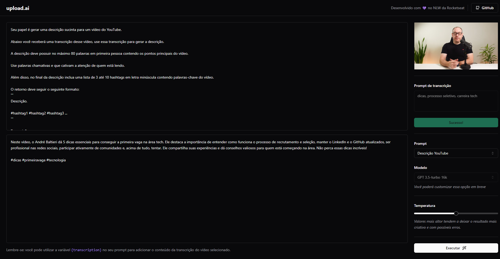

<div align="center">
    <h1>upload.ai</h1>
    <p>AI for Catchy Video Titles and Descriptions with Strong Indexing</p>
</div>

# 💻 Overview

## 👀 About
Upload.ai is a comprehensive platform that uses artificial intelligence (AI) to generate video titles and descriptions. This full-stack application streamlines the audiovisual content production process, making it more efficient and appealing.

<div align="center">
  
</div>

## 🚀 Technologies


# 💻 Getting started

## Requirements

First at all you need to install [Node.js](https://nodejs.org/en/) and [pnpm](https://pnpm.io/pt/) and then you need to get an API key from [OpenAI website](https://openai.com/)


## Installing and running the project

*Clone the project and open two terminals for the back and front projects*

```bash
$ git clone https://gitlab.com/KassiaFraga/next-level-week.git
$ cd next-level-week/upload-ai
```

### Backend

```bash
$ cd api

# Install the dependencies
$ pnpm i

# Make a copy of '.env.example' to '.env'
# and set with YOUR environment variables.
$ cp .env.example .env

# Apply database migrations
$ pnpm prisma migrate dev

# Pre populate database
$ pnpm prisma seed

# Finally, run the api service in a development environment :)
$ pnpm run dev

# Well done, backend is started!
```

> **_NOTE:_**  You can open prisma studio by running the following command:
> ```bash
> $ pnpm prisma studio
> ```

### Frontend

```bash
$ cd web

# Install the dependencies
$ pnpm i

# Finally, run the api service in a development environment :)
$ pnpm run dev

# Well done, frontend is started!
```

# 📝 License

This project is licensed under the MIT License - see the [LICENSE](LICENSE) file for details.

---
⌨️ com ❤️ por [Kassia Fraga](https://github.com/KassiaMabily) 😊
